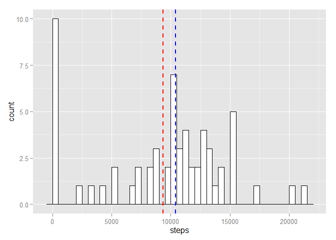
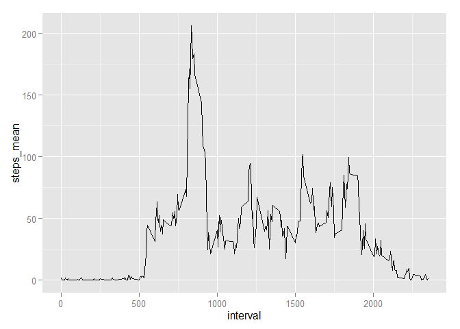
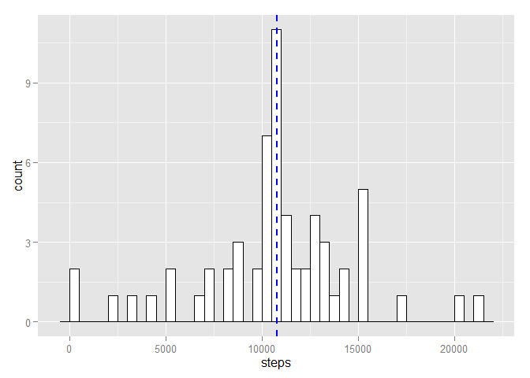
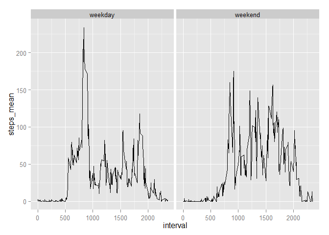

# Reproducible Research: Peer Assessment 1


## Loading and preprocessing the data


```r
unzip("activity.zip")
activity <- fread("activity.csv", sep = ",", na.strings = "NA")
activity[, date := as.POSIXct(date)]
```

## What is mean total number of steps taken per day?


```r
daily_steps <- activity[, list(steps = sum(steps, na.rm = TRUE)), by = date]

ggplot(daily_steps, aes(x = steps)) + 
  geom_histogram(binwidth = 500, colour="black", fill="white") +
  geom_vline(aes(xintercept=mean(steps, na.rm=T)),
             color="red", linetype="dashed", size=1) +
  geom_vline(aes(xintercept=median(steps, na.rm=T)),
             color="blue", linetype="dashed", size=1)
```

 


```r
mean_total_number <- mean(daily_steps$steps)
median_total_number <- median(daily_steps$steps)
```

The mean total number of steps taken per day is 9354.2295082 and the median is 10395.

## What is the average daily activity pattern?


```r
interval_steps_mean <- activity[, list(steps_mean = mean(steps, na.rm = TRUE)), by = interval]
plt <- ggplot( data = interval_steps_mean, aes( interval, steps_mean )) + 
  geom_line()
print(plt)
```

 

```r
interval_with_max_steps <- interval_steps_mean[,.SD[which.max(steps_mean)]]
```

The interval with max number of step is 835.

## Imputing missing values


```r
missing_steps <- sum(is.na(activity$steps))
```

There are 2304 missing values (i.e. intervals without steps).


```r
activity_filled <- merge(activity, interval_steps_mean, by = "interval")
activity_filled[is.na(steps), steps := as.integer(round(steps_mean))]
daily_steps_filled <- activity_filled[, list(steps = sum(steps, na.rm = TRUE)), by = date]

ggplot(daily_steps_filled, aes(x = steps)) + 
  geom_histogram(binwidth = 500, colour="black", fill="white") +
  geom_vline(aes(xintercept=mean(steps, na.rm=T)),
             color="red", linetype="dashed", size=1) +
  geom_vline(aes(xintercept=median(steps, na.rm=T)),
             color="blue", linetype="dashed", size=1)
```

 


```r
mean_total_number_filled <- mean(daily_steps_filled$steps)
median_total_number_filled <- median(daily_steps_filled$steps)
```

With empty values replaced by the mean value of empty interval, the total mean and total median values are changed. Before the empty values are replaced, the mean was 9354.2295082 and median was 10395. Once empty variables replaced the mean value is 1.0765639\times 10^{4} and the median is 10762.


## Are there differences in activity patterns between weekdays and weekends?


```r
activity[wday(date) %in% c(1,7), weekday := "weekend"]
activity[wday(date) %in% c(2,3,4,5,6), weekday := "weekday"]
interval_steps_mean <- activity[, list(steps_mean = mean(steps, na.rm = TRUE)), 
                                by = .(weekday, interval)]

ggplot( data = interval_steps_mean, aes( interval, steps_mean )) +  
      facet_grid(.  ~	weekday) + 
      geom_line() +
      ylab("mean value")
```

 
